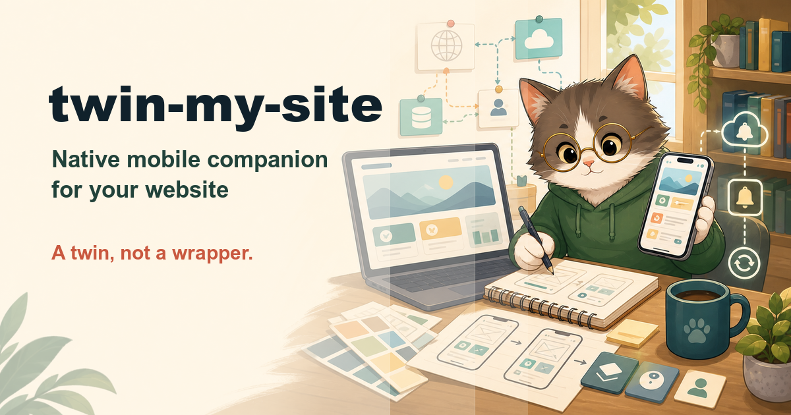

# twin-my-site

**Plan a native mobile companion for your website — a twin, not a wrapper.**

`twin-my-site` is an [agent skill](https://vercel.com/docs/agent-resources/skills)
for the day your web product needs an app. The wrong move is a WebView
wrapper (Apple rejects minimum-functionality shells, and it feels like a
website in a costume). The right move is a **twin**: same brand DNA, same
data, same features where they belong — in a native body with native
idioms. This skill plans that twin from evidence.

## What it does

```
/twin-my-site root: ., driver: push re-engagement + offline reading, platforms: both
```

Say you run a magazine platform on the web with no app:

1. **Feature census** — every user-facing feature mined from routes,
   controllers, and menus (`file:line` each), classified for the app:
   **include** (article reading), **adapt** (mega-menu → tabs), **exclude**
   (editorial CMS stays web), **mobile-new** (push for new issues, offline
   reading — the app's reason to exist).
2. **API audit & contract** — the make-or-break: does the web even have an
   API, or is it server-rendered HTML? Every missing endpoint becomes
   explicit server-side roadmap work with a pointer to the domain code it
   can wrap. The contract is designed API-first: token auth + refresh,
   versioned paths, cursor pagination, mobile-sized media variants,
   ETag-based sync, a full push pipeline.
3. **Design language translation** — the web's actual tokens (colors,
   type, spacing, components, voice — extracted from the CSS, not from
   vibes) translated to native idioms: navbar → tab bar, hover → press
   states, modals → sheets. Same tone, native feel. Includes the decisions
   the web can't answer: dark mode, app icon, **font licensing for app
   embedding** (the classic late surprise).
4. **Stack decision** — native / Flutter / React Native decided (not
   menued) from team skills, web-stack affinity, and census needs.
5. **Mobile-native layer** — offline model, push end-to-end, universal
   links (web URLs open the app), and **current** store rules fetched this
   run: minimum functionality, IAP applicability, account deletion,
   privacy labels.
6. **Store listing & publish kit** — app name candidates from the brand,
   description drafted from the site's own copy (localized), category
   picked from the current store lists, privacy policy audited (or a
   generator recommended — iubenda/Termly/GetTerms — hosted at
   `https://<site>/privacy`), an account-deletion URL designed on the
   existing web auth, and a `store/` folder scaffolded with drafted
   listing, legal, asset-spec, and pre-submission checklist files.
7. **Blueprint** — `docs/TWIN_BLUEPRINT.md`, roadmap phased for
   [deep-plan](https://github.com/silkyland/deep-plan), Phase 1 always a
   **walking skeleton**: real auth + one list + one detail screen through
   the real API on a real device.

## The skill family

| Skill | Moment |
|-------|--------|
| [know-my-repo](https://github.com/silkyland/know-my-repo) | Day one: onboard onto a repo with zero knowledge |
| [deep-plan](https://github.com/silkyland/deep-plan) | Plan the next feature/refactor — evidence-gated |
| [deep-plan-ingest](https://github.com/silkyland/deep-plan) | Distill an accepted plan into living knowledge files |
| [clean-slate](https://github.com/silkyland/clean-slate) | Reset rotten knowledge files — backup-gated |
| [transform-my-repo](https://github.com/silkyland/transform-my-repo) | Change the architecture: migration feasibility + strategy |
| **twin-my-site** | Extend the web product with a native mobile twin |

Shared law: **no claim without evidence** — features cite routes, design
tokens cite CSS, store rules cite current official policy fetched during
the run.

## Install

```bash
npx skills add silkyland/twin-my-site
```

Or copy this directory into your agent's skills folder
(e.g. `~/.claude/skills/twin-my-site/`).

## Structure

```
twin-my-site/
├── SKILL.md                          # 8-step workflow + evidence rules
└── references/
    ├── feature-census.md             # include/adapt/exclude/mobile-new method
    ├── api-contract-guide.md         # Audit rules + mobile API contract design
    ├── design-translation.md         # Token extraction + web→native idiom map
    ├── store-listing-guide.md        # Listing text, category, legal links, store/ publish kit
    └── blueprint-template.md         # docs/TWIN_BLUEPRINT.md structure
```

Follows the [Vercel skills](https://github.com/vercel-labs/skills) single-skill
layout and [Anthropic's skill authoring best practices](https://platform.claude.com/docs/en/agents-and-tools/agent-skills/best-practices).

## License

MIT
